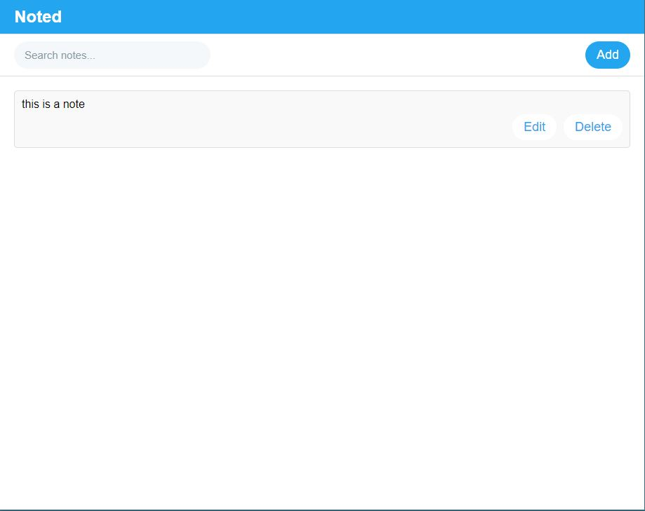

# noted

# Features 
Users can add notes with a text input field and a save button
Notes are saved to local storage so they persist between sessions
Users can view all saved notes in a list
Each note in the list shows the note text and a timestamp of when it was created
Users can edit existing notes by clicking on the note in the list, which opens an edit modal
The edit modal has a text input field and a save button
Users can delete existing notes by clicking on a delete button that appears when they hover over the note in the list
The app has a simple, Twitter-like UI with a header and a button to add new notes.

# UI
The app has a simple, Twitter-like interface
The app has a header with the app name and a button to add new notes
The main content area displays a list of all saved notes
Each note in the list shows the note text and a timestamp of when it was created
Users can click on a note in the list to open an edit modal
The edit modal has a text input field and a save button
Users can click a delete button that appears when they hover over the note in the list to delete the note

# Technologies
HTML (Hypertext Markup Language) for structuring the content of the web page
CSS (Cascading Style Sheets) for styling the visual appearance of the page
JavaScript for adding interactivity and functionality to the app, including handling user events, manipulating the DOM, and interacting with local storage
Local storage for storing notes persistently on the user's device
No external libraries or frameworks were used, making the app lightweight and easy to develop and maintain

